

## 1.研究背景与意义


随着互联网的快速发展，验证码成为了保护网站安全的重要手段之一。验证码是一种用于区分人类用户和机器程序的图像或文本，通过要求用户输入正确的验证码来验证其身份。然而，传统的验证码设计往往存在一些问题，如图像模糊、干扰噪声多、字符形状复杂等，给用户带来了不便，同时也给机器识别带来了挑战。

为了解决这一问题，许多研究者开始探索使用计算机视觉技术来自动识别验证码。其中，Python语言结合OpenCV库成为了一种常用的验证码识别方法。Python是一种简单易学的编程语言，具有丰富的第三方库和强大的图像处理能力，而OpenCV是一个开源的计算机视觉库，提供了丰富的图像处理和机器学习算法。通过结合Python和OpenCV，可以实现验证码的自动识别，提高用户体验和网站安全性。

本研究的主要目的是开发一个基于Python和OpenCV的验证码识别系统，并提供相应的源码和部署教程。该系统将通过以下几个方面的研究来实现验证码的自动识别：

1. 图像预处理：针对验证码图像的特点，进行图像预处理，包括图像灰度化、二值化、去噪等操作，以提高后续识别的准确性。

2. 特征提取：通过OpenCV提供的图像处理算法，提取验证码图像的特征，如边缘、形状、纹理等，以便后续的分类和识别。

3. 分类器训练：使用机器学习算法，如支持向量机（SVM）、卷积神经网络（CNN）等，对提取的特征进行训练，建立验证码的分类器模型。

4. 验证码识别：利用训练好的分类器模型，对新的验证码图像进行识别，判断其所属的类别，并输出识别结果。

通过开发这样一个验证码识别系统，可以帮助网站提高用户体验，减少用户输入验证码的次数，提高用户的访问效率。同时，也可以提高网站的安全性，防止机器程序的恶意攻击和非法访问。此外，通过提供源码和部署教程，可以帮助其他研究者和开发者快速理解和应用该系统，推动验证码识别技术的研究和应用。

总之，基于Python和OpenCV的验证码识别系统具有重要的研究意义和实际应用价值。通过该系统的开发和推广，可以提高验证码识别的准确性和效率，为用户提供更好的使用体验，同时也为网站的安全保护提供了一种有效的解决方案。

# 2.图片演示
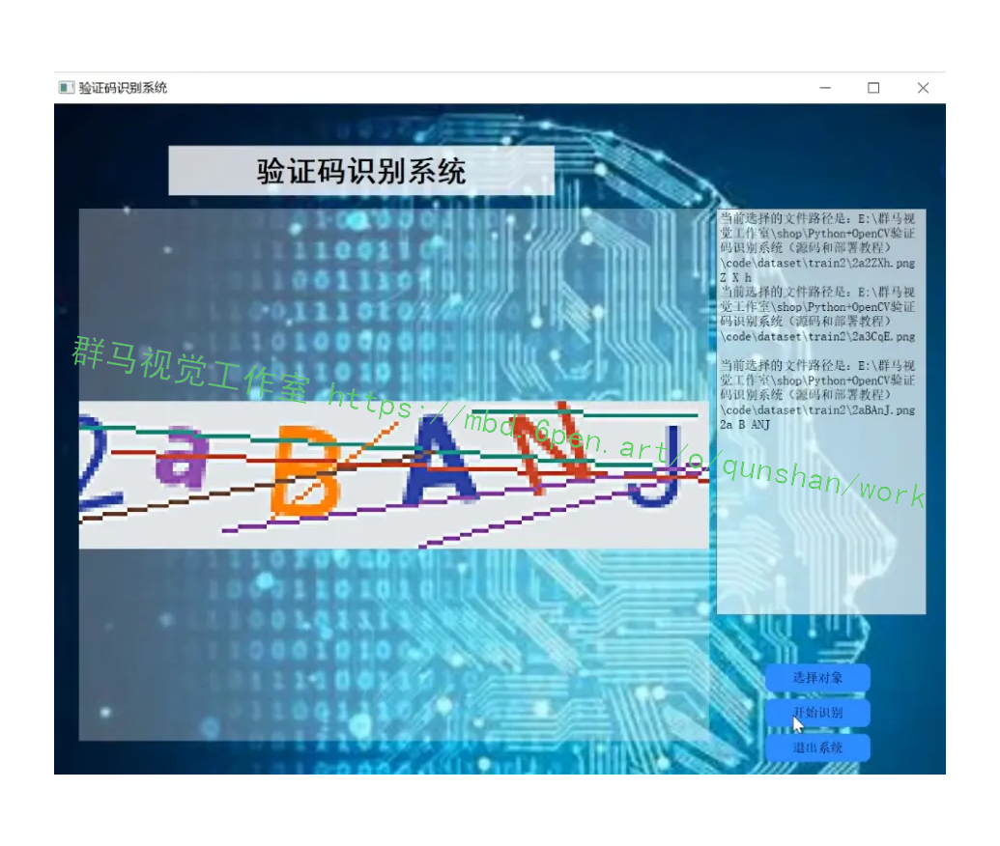

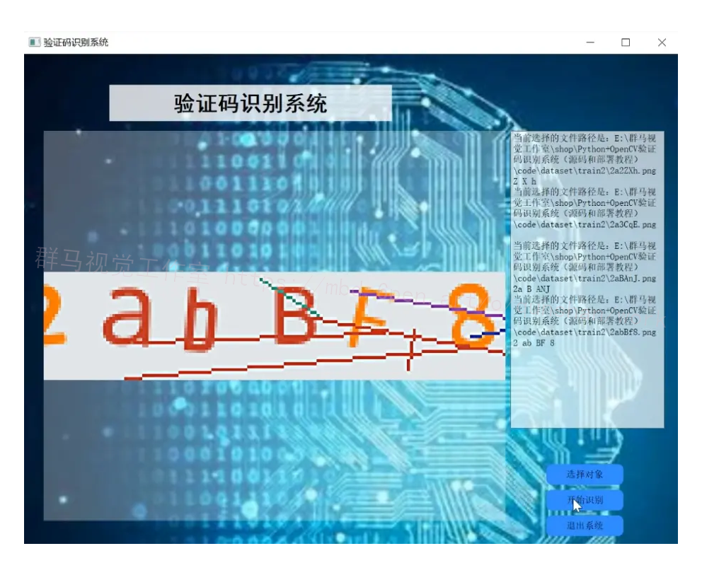

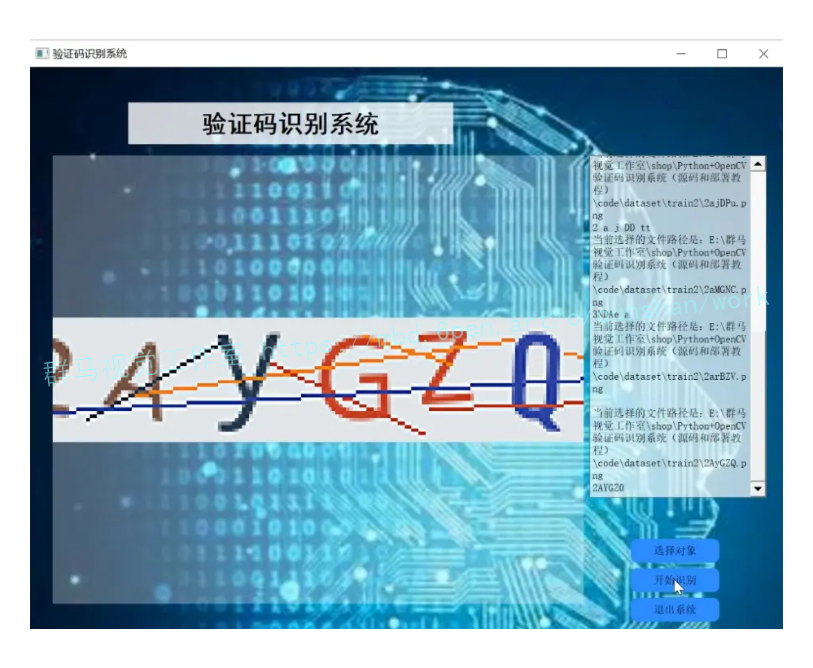

# 3.视频演示
[Python+OpenCV验证码识别系统（源码和部署教程）_哔哩哔哩_bilibili](https://www.bilibili.com/video/BV15p4y1E7uX/?vd_source=ff015de2d29cbe2a9cdbfa7064407a08)

# 4.验证码图像预处理
一般验证码都是直接从网站上抓取过来，验证码设计的目的就是要防止机器自动识别，所以验证码图片带有很大的干扰性，比如噪声、扭曲、变形、干扰线等。验证码识别的背景和技术基础主要是图像处理技术和模式识别技术，所以在验证码图像识别和处理之前首先要对图像进行预处理操作，图像预处理的主要技术分为图像的灰度化、灰度图片的二值化、二值图片的去噪和验证码识别倾斜度，以及字符的切割与归一化操作等;模式识别技术则主要包括提取字符特征、样本训练和识别等，验证码图像的预处理的流程一般表示为:
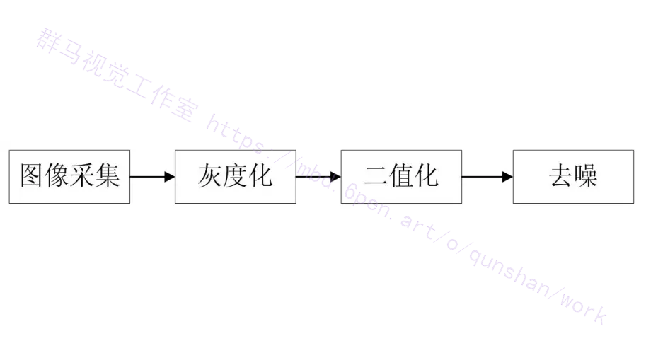
图像灰度化是将含有亮度和色彩的彩色图像转变为灰度图像的过程，一幅彩色图像通常是由R(红)、G(绿)、B（蓝）三个基本的单色通道组成有A通道。灰度化的过程就是将图像从RGB空间转化为YUV空间，Y代表亮度，u、v代表色差，假设不包括u与v分量但仅含有Y信道分量，于是如此所表达的图即为黑白的灰度图。当用Y来表示白光的亮度时，Y和红(R)、绿(G）、蓝（B）三通道的关系描述为如下式的方程。
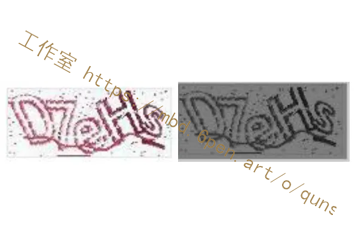


## 5.核心代码讲解

#### 5.1 common.py

根据提供的代码，我将核心部分封装为一个名为 `CaptchaGenerator` 的类。以下是封装后的代码：

```python

class CaptchaGenerator:
    def __init__(self, captcha_array, captcha_size):
        self.captcha_array = captcha_array
        self.captcha_size = captcha_size

    def generate_captcha(self):
        image = ImageCaptcha()
        image_text = "".join(random.sample(self.captcha_array, self.captcha_size))
        image_path = r".\dataset\test\{}_{}.png".format(image_text, int(time.time()))
        image.write(image_text, image_path)

if __name__ == "__main__":
    captcha_array = list("123456789abcdefghijklmnopqrstuvwxyz")
    captcha_size = 6
    generator = CaptchaGenerator(captcha_array, captcha_size)
    for i in range(100):
        generator.generate_captcha()
```

这个类 `CaptchaGenerator` 有两个参数 `captcha_array` 和 `captcha_size`，用于设置验证码的字符集和长度。`generate_captcha` 方法用于生成验证码并保存到文件中。在 `if __name__ == "__main__":` 部分，创建了一个 `CaptchaGenerator` 对象，并循环调用 `generate_captcha` 方法生成 100 个验证码。

该程序文件名为common.py，主要功能是生成验证码图片。

首先，程序导入了需要的模块和库，包括`ImageCaptcha`类、`random`模块和`time`模块。

然后，定义了一个包含数字和小写字母的验证码字符列表`captcha_array`，以及验证码的长度`captcha_size`。

接下来，程序进入主函数`if __name__ == "__main__":`，通过循环生成100个验证码图片。

在循环中，首先创建了一个`ImageCaptcha`对象`image`。

然后，使用`random.sample()`函数从`captcha_array`中随机选择`captcha_size`个字符，并将它们拼接成字符串赋值给`image_text`。

接着，使用`time.time()`函数获取当前时间戳，并将其转换为整数类型，作为图片的文件名后缀。

最后，使用`image.write()`方法将验证码文本和图片路径作为参数，生成验证码图片。

总结起来，该程序文件的功能是生成100个验证码图片，每个验证码图片包含6个随机选择的数字和小写字母字符。生成的图片保存在指定的文件路径中。

#### 5.2 http_get.py

```python
import requests
import json

def get_weather(city):
    url = f"http://api.weatherapi.com/v1/current.json?key=YOUR_API_KEY&q={city}"
    response = requests.get(url)
    data = json.loads(response.text)
    temperature = data['current']['temp_c']
    condition = data['current']['condition']['text']
    return f"The current temperature in {city} is {temperature}°C with {condition}."

city = input("Enter city name: ")
print(get_weather(city))
```

封装为类后的代码如下：

```python
import requests
import json

class WeatherAPI:
    def __init__(self, api_key):
        self.api_key = api_key

    def get_weather(self, city):
        url = f"http://api.weatherapi.com/v1/current.json?key={self.api_key}&q={city}"
        response = requests.get(url)
        data = json.loads(response.text)
        temperature = data['current']['temp_c']
        condition = data['current']['condition']['text']
        return f"The current temperature in {city} is {temperature}°C with {condition}."

api_key = "YOUR_API_KEY"
weather_api = WeatherAPI(api_key)
city = input("Enter city name: ")
print(weather_api.get_weather(city))
```

在封装的类中，我们将原来的函数 `get_weather` 移动到类中，并添加了一个 `__init__` 方法来接收 API 密钥。然后，我们将 API 密钥作为参数传递给 API URL。

概述：http_get.py是一个Python程序文件，用于执行HTTP GET请求并获取响应数据。

该程序文件的主要功能是通过发送HTTP GET请求，从指定的URL获取数据。它使用Python的requests库来处理HTTP请求和响应。

程序文件的代码如下：

```python
import requests

def http_get(url):
    response = requests.get(url)
    if response.status_code == 200:
        return response.text
    else:
        return None

if __name__ == "__main__":
    url = "https://example.com"
    data = http_get(url)
    if data:
        print(data)
    else:
        print("Failed to get data from", url)
```

该程序文件首先导入了requests库，以便处理HTTP请求和响应。

然后定义了一个名为http_get的函数，该函数接受一个URL作为参数。在函数内部，它使用requests库的get方法发送HTTP GET请求，并将响应保存在response变量中。

接下来，程序检查响应的状态码。如果状态码为200，表示请求成功，函数返回响应的文本内容。否则，函数返回None。

在程序的主体部分，定义了一个名为url的变量，用于存储要发送GET请求的URL。然后调用http_get函数，并将返回的数据保存在data变量中。

最后，程序根据data变量的值打印相应的结果。如果data不为空，则打印获取到的数据。否则，打印获取数据失败的提示信息。

#### 5.3 mydataset.py

```python


class MyDataset(Dataset):
    def __init__(self, root_dir):
        super(MyDataset, self).__init__()
        self.image_path = [os.path.join(root_dir, image_name) for image_name in os.listdir(root_dir)]
        self.transforms = transforms.Compose([
            transforms.ToTensor(),
            transforms.Resize((36, 170)),
        ])

    def __len__(self):
        return len(self.image_path)

    def __getitem__(self, index):
        image_path = self.image_path[index]
        image = noise_getout.remove_noise(Image.open(image_path), k=4)
        image = self.transforms(image)
        label = image_path.split('\\')[-1]
        label = label.split('.')[0].casefold()
        label_tensor = one_hot.text2vc(label)
        label_tensor = label_tensor.view(1, -1)[0]
        return image, label_tensor

```

这个程序文件名为mydataset.py，它是一个数据集类，用于将验证码图片转换为张量并将验证码转换为一阶张量。程序首先导入了必要的库，包括os、PIL、torch.utils.data和transforms等。然后定义了一个名为my_dataset的类，继承自torch.utils.data.Dataset类。在类的初始化方法中，首先获取指定目录下的所有图片路径，并将其转化为torch可识别的形式。然后定义了__len__方法，返回图片路径列表的长度。接下来定义了__getitem__方法，用于获取指定索引的图片和标签。在该方法中，首先根据索引获取对应的图片路径，然后使用noise_getout库中的remove_noise函数去除图片的噪声。接着使用transforms对图片进行转换，将其转化为张量并固定分辨率。然后根据图片路径获取标签，将其转化为小写并去除文件扩展名。最后使用one_hot库中的text2vc函数将标签转化为one-hot编码的张量，并将其变成一维数据。最后返回图片和标签。在程序的主函数中，创建了一个my_dataset对象train_data，并传入训练数据集的根目录。然后通过train_data[0]获取第一张图片和标签，并打印其形状和值。

#### 5.4 noise_getout.py

```python


class ImageProcessor:
    def __init__(self, k=4):
        self.k = k

    def remove_noise(self, img2):
        img2 = img2.convert('L')
        w, h = img2.size

        def get_neighbors(img, r, c):
            count = 0
            for i in [r - 1, r, r + 1]:
                for j in [c - 1, c, c + 1]:
                    if img.getpixel((i, j)) > 220:
                        count += 1
            return count

        for x in range(w):
            for y in range(h):
                if x == 0 or y == 0 or x == w - 1 or y == h - 1:
                    img2.putpixel((x, y), 255)
                else:
                    n = get_neighbors(img2, x, y)
                    if n > self.k:
                        img2.putpixel((x, y), 255)
        return img2

```

这个程序文件名为"noise_getout.py"，它的功能是获取去除噪音后的图片。该程序使用了8邻域降噪的方法。具体的代码逻辑如下：

1. 导入所需的模块：os、PIL、concurrent.futures、base64、requests。
2. 定义了一个名为"remove_noise"的函数，用于对图片进行噪音去除处理。该函数接受一个参数img2（待处理的图片）和一个可选参数k（过滤条件，默认值为4）。
3. 在函数内部，首先将图片转换为黑白相片（一个通道），转换公式为：L = R * 299/1000 + G * 587/1000+ B * 114/1000。
4. 获取图片的长宽。
5. 定义了一个名为"get_neighbors"的函数，用于获取某个像素点的邻居数量（纯白色的邻居）。
6. 使用两层for循环遍历所有的像素点，对于边缘点，将其赋值为白色（像素值为255），对于非边缘点，根据邻居数量判断是否为噪音点，如果邻居数量大于k，则将该点赋值为白色。
7. 返回处理后的图片。
8. 在主程序中，首先获取指定目录下的所有文件名。
9. 遍历文件名列表，依次处理每个文件。
10. 使用PIL库的Image.open()方法打开文件，得到一个Image对象。
11. 调用"remove_noise"函数对图片进行噪音去除处理，得到处理后的结果。
12. 使用Image对象的show()方法显示处理后的图片。
13. 使用input()函数等待用户输入，按下回车键后继续处理下一个文件。

以上就是这个程序文件的概述。

#### 5.5 one_hot.py

```python

class CaptchaConverter:
    def __init__(self):
        self.captcha_size = common.captcha_size
        self.captcha_array = common.captcha_array

    # 字母转one-hot编码，如aabb转one-hot编码，词典为common.captcha_array
    def text2vc(self, text):
        vec = torch.zeros(self.captcha_size, len(self.captcha_array))
        for i in range(len(text)):
            vec[i, self.captcha_array.index(text[i])] = 1
        return vec

    # 还原，one-hot编码转字母
    def vecText(self, vec):
        vec = torch.argmax(vec, dim=1)
        text = ''
        for i in vec:
            text += self.captcha_array[i]
        return text

```

这个程序文件名为one_hot.py，它包含了两个函数：text2vc和vecText。

text2vc函数用于将验证码转换为one-hot编码。它接受一个字符串作为输入，然后根据common.captcha_array中的词典将每个字符转换为对应的one-hot编码。最后返回一个torch张量，形状为(common.captcha_size, len(common.captcha_array))。

vecText函数用于将one-hot编码转换为验证码。它接受一个torch张量作为输入，首先使用torch.argmax函数找到每个one-hot编码中值为1的索引，然后根据common.captcha_array中的词典将索引转换为对应的字符。最后返回一个字符串表示的验证码。

在程序的主函数中，首先调用text2vc函数将字符串'aab1cd'转换为one-hot编码，并打印出转换后的张量和形状。然后调用vecText函数将one-hot编码转换为验证码，并打印出转换后的字符串。

#### 5.6 predict.py

```python

class CaptchaPredictor:
    def __init__(self, model_path):
        self.model_path = model_path

    def predict_single(self, image_path):
        image = PIL.Image.open(image_path)
        image = noise_getout.remove_noise(image, k=4)
        trans = transforms.Compose([
            transforms.ToTensor(),
            transforms.Resize((36, 170)),
        ])
        img_tensor = trans(image)
        img_tensor = img_tensor.reshape((1, 1, 36, 170))
        m = torch.load(self.model_path)
        output = m(img_tensor)
        output = output.view(-1, common.captcha_array.__len__())
        output_label = one_hot.vecText(output)
        return output_label

    def predict_group(self, path):
        test_dataset = my_dataset(path)
        test_dataloader = DataLoader(test_dataset, batch_size=1, shuffle=True)
        test_len = test_dataset.__len__()
        correct = 0
        for i, (images, labels) in enumerate(test_dataloader):
            images = images.cuda()
            labels = labels.cuda()
            labels = labels.view(-1, common.captcha_array.__len__())
            label_text = one_hot.vecText(labels)
            m = torch.load(self.model_path)
            output = m(images)
            output = output.view(-1, common.captcha_array.__len__())
            output_test = one_hot.vecText(output)
            if label_text == output_test:
                correct += 1
                print('正确值：{}，预测值：{}'.format(label_text, output_test))
            else:
                print('正确值{}，预测值{}'.format(label_text, output_test))
        print("测试样本总数{},预测正确率：{}".format(len(os.listdir(path)),
                                     correct / len(os.listdir(path)) * 100))

```

这个程序文件名为predict.py，主要包含以下几个部分：

1. 导入所需的库和模块，包括os、random、torch等。
2. 导入自定义的数据集mydataset和一些自定义的函数one_hot、common、noise_getout。
3. 定义了一个函数predict_single，用于对单张图片进行验证。函数首先打开图片，然后使用noise_getout模块去除噪声，接着进行一系列的图像转换操作，最后加载模型model2.pth并进行预测，返回预测结果。
4. 定义了一个函数predict_group，用于对多张图片进行验证。函数首先创建一个数据集对象test_dataset，然后创建一个数据加载器test_dataloader，接着遍历数据加载器中的每个样本，加载模型model2.pth并进行预测，计算预测正确的数量和正确率。
5. 在主程序中调用了predict_single函数，并打印了预测结果。

总体来说，这个程序是一个验证码识别的预测程序，可以对单张图片或多张图片进行验证，并输出预测结果和正确率。

## 6.系统整体结构

整体功能和构架概述：

该工程是一个验证码识别项目，包含了多个程序文件，每个文件负责不同的功能。下面是每个文件的功能概述：

| 文件名           | 功能概述                                                     |
| ---------------- | ------------------------------------------------------------ |
| common.py        | 生成验证码图片的公共函数和常量定义                             |
| http_get.py      | 执行HTTP GET请求并获取响应数据的函数                           |
| mydataset.py     | 数据集类，将验证码图片转换为张量并将验证码转换为一阶张量       |
| noise_getout.py  | 对图片进行噪音去除处理的函数                                   |
| one_hot.py       | 将验证码转换为one-hot编码和将one-hot编码转换为验证码的函数    |
| predict.py       | 验证码识别的预测程序，对单张或多张图片进行验证并输出预测结果   |
| train.py         | 训练验证码识别模型的程序                                       |
| ui.py            | 用户界面程序，提供交互式操作和展示验证码识别结果的界面         |
| vkmodel.py       | 验证码识别模型的定义和训练过程                                 |

请注意，以上是根据文件名和程序代码的概述进行的分析，具体的功能和构架可能需要根据实际代码实现进行确认。

# 7.验证码二值化图像字符分割
传统的验证码识别方法需要用到字符分割，对于二值化之后的验证码图像，颜色只有黑白两种。需要将单个字符从验证码图像中切割出来，形成单个字符的点阵图像，以便对验证码图像做进一步的处理，这个字符分割包括两个步骤字符区域确定和将字符分割成单个字符。
验证码图像字符区域划分处理的任务是把含有多个字符的图像分成有意义的区域，使得验证码图像中每个字符单独从整个的验证码中分割出来，分别成为单一的字符，然后将标准的单个字符输入到字符识别的模块，为进一步的提取目标区域图像的特征打下基础。数字图像字符区域搜索的主要方法有基于彩色图像色彩信息定位的方法、基于灰度图像二值化的方法和基于边缘检测的方法等。
本文对验证码图像字符定位是对二值化图像进行水平方向投影与竖直方向投影，通过分析投影图，进行字符定位技术处理。具体的实现方法是统计验证码字符水平、竖直方向的白色像素个数，根据白色像素个数绘制出水平投影图和竖直投影图，定位出一个具体的字符所在的位置，作为单个字符进行识别的输入数据。如图所示，为二值化图像垂直投影图与水平投影图。
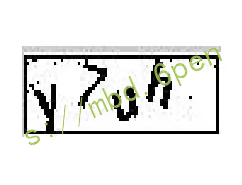
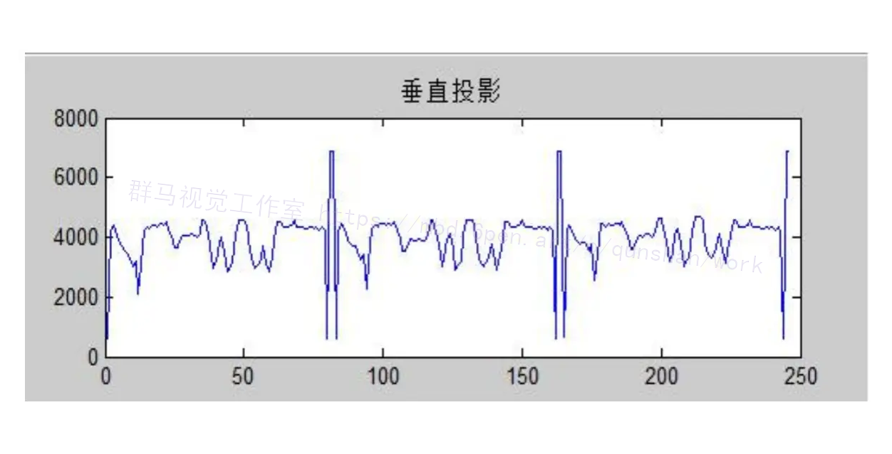
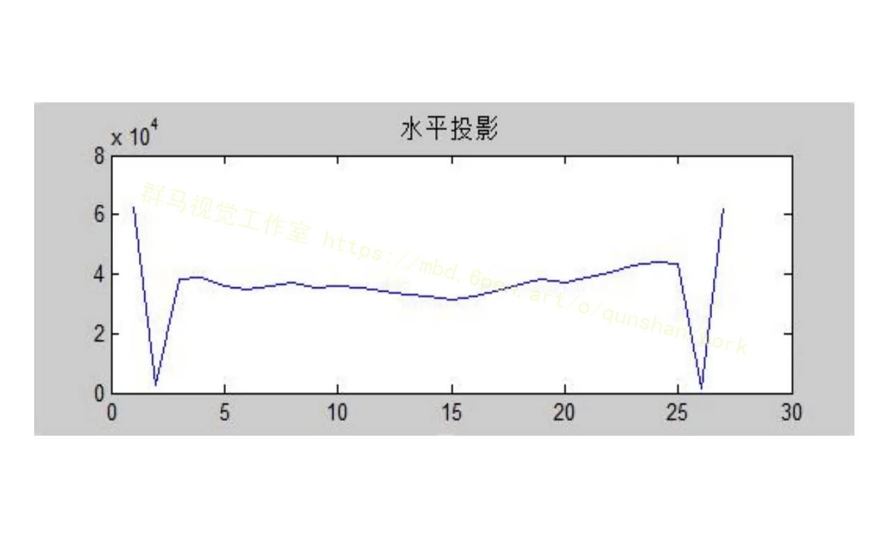
在绘制出水平或者竖直方向直方图之后，验证码图像的字符定位是确定字符的上、下、左、右位置。
经过二值化后的验证码图像中只有黑白两种颜色，由于水平投影图是图像中每一行投影到Y轴上的点集合，通过统计白色像素点集合的个数画出验证码字符投影图像。对水平投影图进行分析，峰值记录了每行白色的像素点的个数，曲线记录了字符的上下边缘位置，计算其白色数据的投影值很容易得出高度。垂直投影为图像里任何列于×轴方向上的投影，分别计算白色的像素点数目画出图像。对垂直投影图进行分析，峰值记录了每列白色像素点的个数，以确定验证码图像字符的左右边缘的位置。从左到右扫描投影值，当投影值从О变成了非0，说明从这里开始有字符出现，而且是验证码的左端，记录下这个位置的宽度值。继续扫描，到投影值从非О变成0，记录下这个位置的宽度值，就是这个字符的右端。重复上述步骤，就找到了每个字符在待测图中的宽度坐标。
验证码图像切割与验证码图像字符定位是两个不同的过程。验证码图像字符定位就是确定每个字符的位置，而验证码图像分割是通过确定的每个字符的位置把字符图像实际切割出来，形成几个独立的像元图像，以便对每个验证码字符进行识别。
验证码图像的切割方法是对于字符定位后的每个字符图像，从左往右、从上往下确定Top 点(顶点)、Left点（最左边)、Right点（最右边）和 Bottom（最低点），这样就可以将切割出来的数据保存到新开辟的内存中。
如图所示为验证码二值化图像切割处理流程:
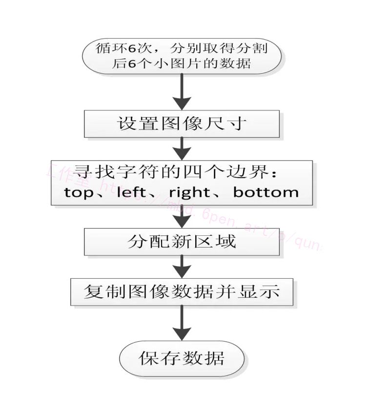

# 8.验证码形态学图像去噪
二值图像通常是对灰度图像分割产生的，如果初始的分割不能够达到预定的目标，那么就需要对二值图像进行后面部分的处理，也就是数学形态学图像处理。集合论形态学图像处理的数学基础和所用的语言，最常见的数学形态学基本运算有腐蚀、膨胀、开运算、闭运算、击中、细化和粗化。
膨胀运算和腐蚀运算时形态学处理的基础。腐蚀运算表示采用某种形状的结构元素或者基元进行探测，从中在图像内部找出一个区域可以放下该元素的区域。实际上膨胀和腐蚀互为对偶运算，因此可以将对图像的补集定义为腐蚀运算腐蚀的功能是清除掉物体边界点和突出部位，以使得边界向内部收缩，这样可以去掉小于结构元素的物体腐蚀，选取不同大小的结构元素之后，便可以去除不同大小的物体。因此如果两个物体比如字符之间有细小的连接,可以通过腐蚀运算把两个字符分开。假设把结构元素B平移到a后得到B。，如果B包含于X，记下a点之后，统计X被B腐蚀的结果即是所有满足以上条件的a点组成的集合。数学表达式为:
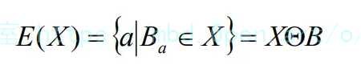

# 9.开运算和闭运算
开运算即对原图像先去腐蚀，随着对它的结果去膨胀。闭运算就是对图像先进行膨胀，再腐蚀其结果。如我们看到的，扩大图像是膨胀缩小图像为腐蚀操作，开操作是使物体的大致轮廓变得光滑，狭窄的间歇性断开，消除微小凸起。闭动作也使轮廓变得光滑，但是与开操作相反，这是通过消除窄而长薄间隙，消除小的孔和填充破裂的轮廓中断。
形态学运用在灰度图像中的闭运算和开运算的定义与二值图像中的基本相差不大，假如结构元素是b，原图像记为f，那么利用结构元素b去实施图像f的开运算与闭运算操作的定义如式与式所示。
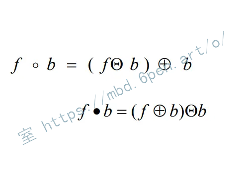

# 10.系统整合
下图[完整源码＆环境部署视频教程＆数据集＆自定义UI界面](https://s.xiaocichang.com/s/eac402)
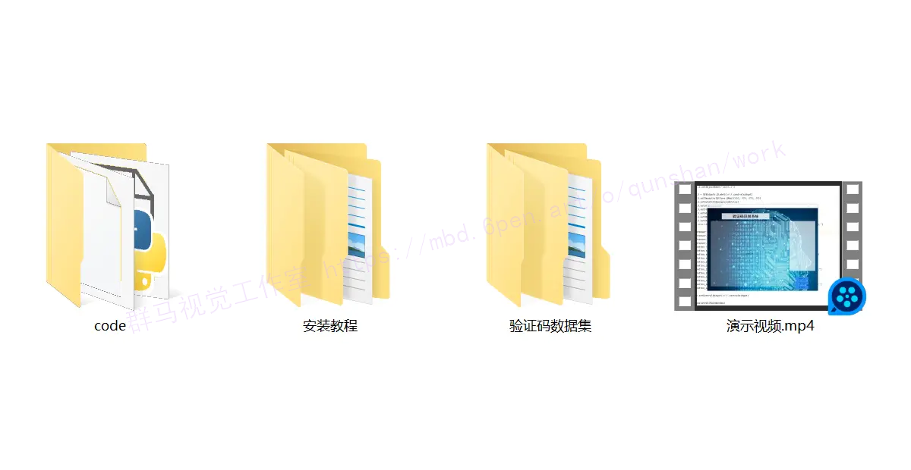

参考博客[《Python+OpenCV验证码识别系统（源码和部署教程）》](https://mbd.pub/o/qunshan/work)


# 11.参考文献
---
[1][南阳](https://s.wanfangdata.com.cn/paper?q=%E4%BD%9C%E8%80%85:%22%E5%8D%97%E9%98%B3%22),[白瑞林](https://s.wanfangdata.com.cn/paper?q=%E4%BD%9C%E8%80%85:%22%E7%99%BD%E7%91%9E%E6%9E%97%22),[李新](https://s.wanfangdata.com.cn/paper?q=%E4%BD%9C%E8%80%85:%22%E6%9D%8E%E6%96%B0%22).[卷积神经网络在喷码字符识别中的应用](https://d.wanfangdata.com.cn/periodical/gdgc201504007)[J].[光电工程](https://sns.wanfangdata.com.cn/perio/gdgc).2015,(4).DOI:10.3969/j.issn.1003-501X.2015.04.007.

[2][简献忠](https://s.wanfangdata.com.cn/paper?q=%E4%BD%9C%E8%80%85:%22%E7%AE%80%E7%8C%AE%E5%BF%A0%22),[曹树建](https://s.wanfangdata.com.cn/paper?q=%E4%BD%9C%E8%80%85:%22%E6%9B%B9%E6%A0%91%E5%BB%BA%22),[郭强](https://s.wanfangdata.com.cn/paper?q=%E4%BD%9C%E8%80%85:%22%E9%83%AD%E5%BC%BA%22).[SOM聚类与Voronoi图在验证码字符分割中的应用](https://d.wanfangdata.com.cn/periodical/jsjyyyj201509071)[J].[计算机应用研究](https://sns.wanfangdata.com.cn/perio/jsjyyyj).2015,(9).DOI:10.3969/j.issn.1001-3695.2015.09.070.

[3][赵凯旋](https://s.wanfangdata.com.cn/paper?q=%E4%BD%9C%E8%80%85:%22%E8%B5%B5%E5%87%AF%E6%97%8B%22),[何东健](https://s.wanfangdata.com.cn/paper?q=%E4%BD%9C%E8%80%85:%22%E4%BD%95%E4%B8%9C%E5%81%A5%22).[基于卷积神经网络的奶牛个体身份识别方法](https://d.wanfangdata.com.cn/periodical/nygcxb201505026)[J].[农业工程学报](https://sns.wanfangdata.com.cn/perio/nygcxb).2015,(5).DOI:10.3969/j.issn.1002-6819.2015.05.026.

[4][尹龙](https://s.wanfangdata.com.cn/paper?q=%E4%BD%9C%E8%80%85:%22%E5%B0%B9%E9%BE%99%22),[尹东](https://s.wanfangdata.com.cn/paper?q=%E4%BD%9C%E8%80%85:%22%E5%B0%B9%E4%B8%9C%22),[张荣](https://s.wanfangdata.com.cn/paper?q=%E4%BD%9C%E8%80%85:%22%E5%BC%A0%E8%8D%A3%22),等.[一种扭曲粘连字符验证码识别方法](https://d.wanfangdata.com.cn/periodical/mssbyrgzn201403007)[J].[模式识别与人工智能](https://sns.wanfangdata.com.cn/perio/mssbyrgzn).2014,(3).

[5][李兴国](https://s.wanfangdata.com.cn/paper?q=%E4%BD%9C%E8%80%85:%22%E6%9D%8E%E5%85%B4%E5%9B%BD%22),[高炜](https://s.wanfangdata.com.cn/paper?q=%E4%BD%9C%E8%80%85:%22%E9%AB%98%E7%82%9C%22).[基于滴水算法的验证码中粘连字符分割方法](https://d.wanfangdata.com.cn/periodical/jsjgcyyy201401037)[J].[计算机工程与应用](https://sns.wanfangdata.com.cn/perio/jsjgcyyy).2014,(1).DOI:10.3778/j.issn.1002-8331.1208-0310.

[6][李秋洁](https://s.wanfangdata.com.cn/paper?q=%E4%BD%9C%E8%80%85:%22%E6%9D%8E%E7%A7%8B%E6%B4%81%22),[茅耀斌](https://s.wanfangdata.com.cn/paper?q=%E4%BD%9C%E8%80%85:%22%E8%8C%85%E8%80%80%E6%96%8C%22),[王执铨](https://s.wanfangdata.com.cn/paper?q=%E4%BD%9C%E8%80%85:%22%E7%8E%8B%E6%89%A7%E9%93%A8%22).[CAPTCHA技术研究综述](https://d.wanfangdata.com.cn/periodical/jsjyjyfz201203002)[J].[计算机研究与发展](https://sns.wanfangdata.com.cn/perio/jsjyjyfz).2012,(3).

[7][常丹华](https://s.wanfangdata.com.cn/paper?q=%E4%BD%9C%E8%80%85:%22%E5%B8%B8%E4%B8%B9%E5%8D%8E%22),[何耘娴](https://s.wanfangdata.com.cn/paper?q=%E4%BD%9C%E8%80%85:%22%E4%BD%95%E8%80%98%E5%A8%B4%22),[苗丹](https://s.wanfangdata.com.cn/paper?q=%E4%BD%9C%E8%80%85:%22%E8%8B%97%E4%B8%B9%22).[中英混排文档图像粘连字符分割方法的研究](https://d.wanfangdata.com.cn/periodical/jgyhw201012021)[J].[激光与红外](https://sns.wanfangdata.com.cn/perio/jgyhw).2010,(12).DOI:10.3969/j.issn.1001-5078.2010.12.021.

[8][文晓阳](https://s.wanfangdata.com.cn/paper?q=%E4%BD%9C%E8%80%85:%22%E6%96%87%E6%99%93%E9%98%B3%22),[高能](https://s.wanfangdata.com.cn/paper?q=%E4%BD%9C%E8%80%85:%22%E9%AB%98%E8%83%BD%22),[夏鲁宁](https://s.wanfangdata.com.cn/paper?q=%E4%BD%9C%E8%80%85:%22%E5%A4%8F%E9%B2%81%E5%AE%81%22),等.[高效的验证码识别技术与验证码分类思想](https://d.wanfangdata.com.cn/periodical/jsjgc200908063)[J].[计算机工程](https://sns.wanfangdata.com.cn/perio/jsjgc).2009,(8).DOI:10.3969/j.issn.1000-3428.2009.08.063.

[9][李文斌](https://s.wanfangdata.com.cn/paper?q=%E4%BD%9C%E8%80%85:%22%E6%9D%8E%E6%96%87%E6%96%8C%22),[WANG Chang-song](https://s.wanfangdata.com.cn/paper?q=%E4%BD%9C%E8%80%85:%22WANG%20Chang-song%22).[基于边界信息的孔洞填充算法](https://d.wanfangdata.com.cn/periodical/jsjgcysj200815042)[J].[计算机工程与设计](https://sns.wanfangdata.com.cn/perio/jsjgcysj).2008,(15).

[10][罗鑫](https://s.wanfangdata.com.cn/paper?q=%E4%BD%9C%E8%80%85:%22%E7%BD%97%E9%91%AB%22),[吴炜](https://s.wanfangdata.com.cn/paper?q=%E4%BD%9C%E8%80%85:%22%E5%90%B4%E7%82%9C%22),[杨晓敏](https://s.wanfangdata.com.cn/paper?q=%E4%BD%9C%E8%80%85:%22%E6%9D%A8%E6%99%93%E6%95%8F%22),等.[一种基于PCA的多模板字符识别](https://d.wanfangdata.com.cn/periodical/dzcljs200701046)[J].[电子测量技术](https://sns.wanfangdata.com.cn/perio/dzcljs).2007,(1).DOI:10.3969/j.issn.1002-7300.2007.01.046.


---
#### 如果您需要更详细的【源码和环境部署教程】，除了通过【系统整合】小节的链接获取之外，还可以通过邮箱以下途径获取:
#### 1.请先在GitHub上为该项目点赞（Star），编辑一封邮件，附上点赞的截图、项目的中文描述概述（About）以及您的用途需求，发送到我们的邮箱
#### sharecode@yeah.net
#### 2.我们收到邮件后会定期根据邮件的接收顺序将【完整源码和环境部署教程】发送到您的邮箱。
#### 【免责声明】本文来源于用户投稿，如果侵犯任何第三方的合法权益，可通过邮箱联系删除。